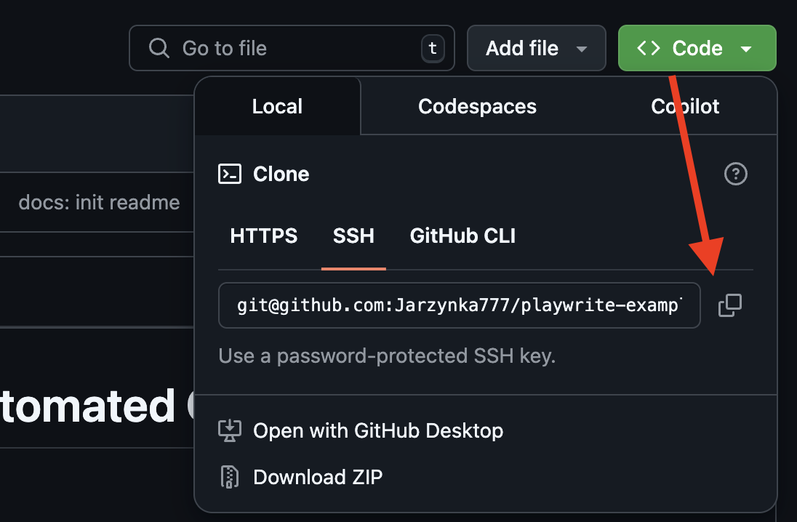

# Getting started into Automated QA

Summary of zoom meeting

# Table of Contents

- [Prerequisites](#prerequisites)
- [Setting up QA environment](#setting-up-qa-environment)
- [Setting up QA project](#setting-up-qa-environment)
- [Cheatsheets](#cheatsheets)

## Prerequisites

1. Registered [GitHub](https://github.com/) account
2. Code Editor / IDE e.g. [Visual Studio Code](https://code.visualstudio.com/)

## Setting up QA environment

### 1. Homebrew

[Homebrew](<https://en.wikipedia.org/wiki/Homebrew_(package_manager)>) - is a free and open-source software **package management system** that simplifies the installation of software on Apple's operating system, macOS, as well as Linux.

### GIT

1. [Git](https://en.wikipedia.org/wiki/Git) - version control system that **tracks versions of files**.

[Install `git` via `Homebrew`](https://formulae.brew.sh/formula/git):

```bash
brew install git
```

Confirm installation with:

```bash
git -v
```

### Setup SSH key for GitHub login:

Let's use one of the next sections from from [Connecting to GitHub with SSH](https://docs.github.com/en/authentication/connecting-to-github-with-ssh):

- [Checking for existing SSH keys](https://docs.github.com/en/authentication/connecting-to-github-with-ssh/checking-for-existing-ssh-keys)
- [Generating a new SSH key and adding it to the ssh-agent](https://docs.github.com/en/authentication/connecting-to-github-with-ssh/generating-a-new-ssh-key-and-adding-it-to-the-ssh-agent) section

1. Check is there are SSH keys which are available right now:

```bash
ls -al ~/.ssh
```

If there are keys - copy them to `clipboard`:

```bash
pbcopy < ~/.ssh/KEY_NAME.pub
```

If there are no keys - create the next one:

```bash
ssh-keygen -t ed25519 -C "your_email@example.com"
```

Copy it to clipboard and add in GitHub profile:

```bash
pbcopy < ~/.ssh/KEY_NAME.pub
```

### NVM

3. `nvm` - Node Version Manager allows you to quickly **install and use different versions of Node.js** via the command line.

[Install `nvm` via `Homebrew`](https://formulae.brew.sh/formula/nvm):

```bash
brew install nvm
```

Confirm installation with:

```bash
nvm -v
```

[Important notes](https://github.com/nvm-sh/nvm?tab=readme-ov-file#important-notes):

> Homebrew installation is not supported.

Please use [How to install NVM (Node Version Manager) on macOS - Medium tutorial](https://sukiphan.medium.com/how-to-install-nvm-node-version-manager-on-macos-d9fe432cc7db)

After the `nvm` installed with `brew install` command - please edit `~/.zshrc` file, by adding:

```bash
export NVM_DIR="$HOME/.nvm"
  [ -s "/opt/homebrew/opt/nvm/nvm.sh" ] && \. "/opt/homebrew/opt/nvm/nvm.sh"  # This loads nvm
  [ -s "/opt/homebrew/opt/nvm/etc/bash_completion.d/nvm" ] && \. "/opt/homebrew/opt/nvm/etc/bash_completion.d/nvm"  # This loads nvm bash_completion
```

### Node.js + npm

4. Install Node.js version based on [nvm documentation](https://github.com/nvm-sh/nvm?tab=readme-ov-file#usage)

```bash
# show all version
nvm ls-remote

# install desired version
nvm install 22.15.0
```

Change the Node.js version by default:

```bash
# set default Node.js version
nvm alias default 22.15.0
```

Confirm installation with:

```bash
# check node version
node -v
```

### npm

5. [npm](https://en.wikipedia.org/wiki/Npm) [http://npmjs.com/](http://npmjs.com/) - is a package manager for the JavaScript.

Installed together with Node.js (in previous step) by `nvm install` command

Confirm installation with:

```bash
# check npm -v
npm -v
```

## Setting up QA project

1. Create new repository in GitHub and clone it to local computer:
   

2. Playwrite chosen as framework for Automated QA:

- [npm package playwright](https://www.npmjs.com/package/playwright)
- [Playwright - documentation](https://playwright.dev/docs/intro)

**Installation** - Using init command:
The easiest way to get started with Playwright Test is to run the init command.

```bash
# Run from your project's root directory
npm init playwright@latest
# Or create a new project
npm init playwright@latest new-project
```

3. Commit add changes and push to repo
```bash
git add .

git commit -m "YOUR CUSTOM MESSAGE"

git push origin main
```

## Cheatsheets

1.1. Useful terminal commands:

```bash
# show current folder content
ls

# create new folder
mkdir NAME_DIR

# go to path
cd ./PATH_NAME

# go to parent folder
cd ../

# force delete Folder and it's ALL content inside
rm -rf ./PATH_TO_DIR

# cancel current operation
cmnd + C
```

1.2. Use :

- `tab` in terminal for auto complete
- `arrow up` - previously executed command
- `arrow up` - next command

2. VSCode terminal commands:

```bash
# open current folder in VSCode
code .
```
